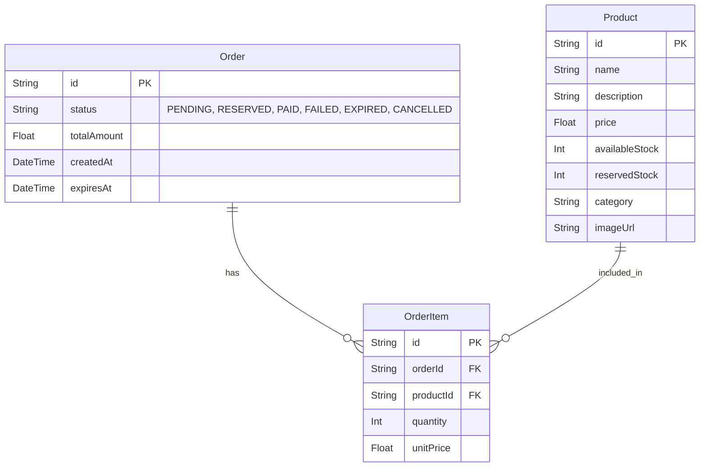

# Task 02: E-Commerce Checkout & Payment System Architecture

## 1. Tech Stack Overview
- **Frontend:** Next.js (App Router), TypeScript, Vanilla CSS (Premium UI with Glassmorphism)
- **Backend:** Node.js, Express.js, TypeScript
- **Database:** PostgreSQL
- **ORM:** Prisma
- **State Management:** Zustand (for Cart state)

## 2. High-Level Architecture
The system follows a standard Client-Server architecture with RESTful APIs.

```mermaid
graph TD
    Client[Next.js Frontend] -->|REST API (JSON)| API[Express.js Backend]
    API -->|Prisma ORM| DB[(PostgreSQL)]
    
    subgraph Frontend Features
        Home[Product Discovery]
        Cart[Shopping Cart]
        Checkout[Checkout & Payment Mock]
        History[Order History]
    end
    
    subgraph Backend Services
        ProductSvc[Product Service]
        OrderSvc[Order & Checkout Service]
        PaymentSvc[Mock Payment Service]
    end
```

## 3. Database Schema (Prisma)
We will use a relational model to maintain data integrity.



## 4. Concurrency & Stock Management Strategy
To prevent overselling when multiple customers try to buy the last item at the exact same time, we will use **Database-level pessimistic locking**. 

1. **Locking:** When an order is created, the backend starts a transaction and uses `SELECT ... FOR UPDATE` (via Prisma `$queryRaw` or interactive transactions) on the specific product rows.
2. **Reservation:** The requested quantity is subtracted from `availableStock` and added to `reservedStock`.
3. **Expiry:** A background cron job (or delayed job) will run to find `RESERVED` orders past their `expiresAt` (5 mins) and revert the stock.

## 5. Mock Payment Flow
- **Success:** Status changes to `PAID`. `reservedStock` is permanently deducted.
- **Failed:** Status changes to `FAILED`. `reservedStock` is restored to `availableStock`.
- **Timeout:** Treated as a failure/timeout. Status changes to `EXPIRED` (or `FAILED`) and stock is restored.
